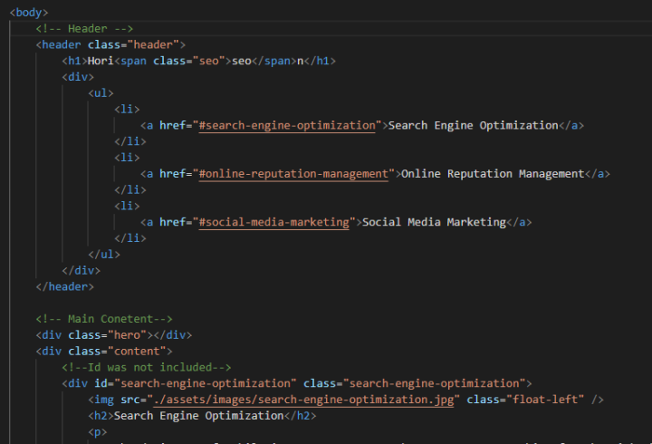
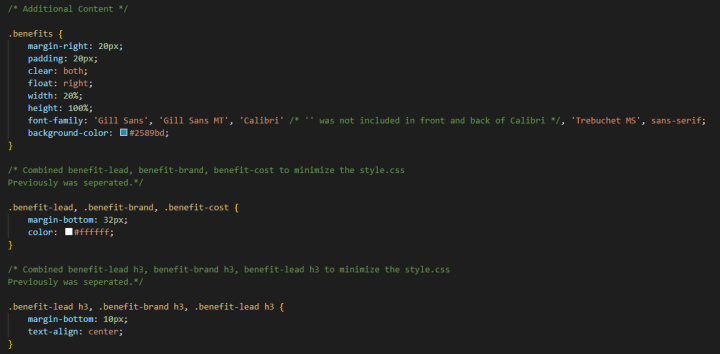

# Horiseon Refractor

BootCamp Challenge - 01 HTML, CSS, and Git & Advanced CSS

## Description

- To learn how to refractor an existing webpage to make it accessible to the public.
- I refractored this project to understand and anaylze reading index.html and style.css.
- I learned to refractor, reading previous coding, and fixing errors/organzing code to make it easier to read.

## Process

To understand the objective of the challenge, I first read through the index.html, style.css and the README.md. I researched the Web accesibility standards and formatting README.md to make it easier for other to read. 

Throughout the index.html and style.css, I included comments of changes thats were made or descriptive content for easier read for readers.

Example:

Additional Example:

## Finale

With the modifications that were made, the webpage is fully accessible and read to be used. If corrections need to be made, the comments and organziation will allow future coders to easily navigate through the codes.

## Installation

Project is uploaded to [Github](https://github.com/) at the following [repository.](https://github.com/mysteriousdj/horiseon-seo-refractor)

Access to completed [Webpage.](https://mysteriousdj.github.io/horiseon-seo-refractor/)

